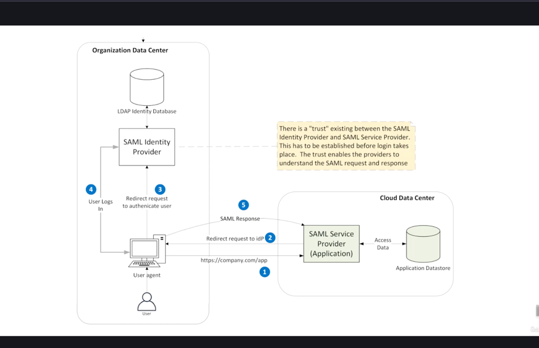
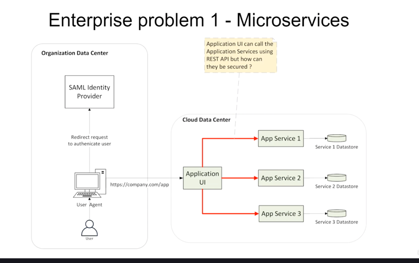
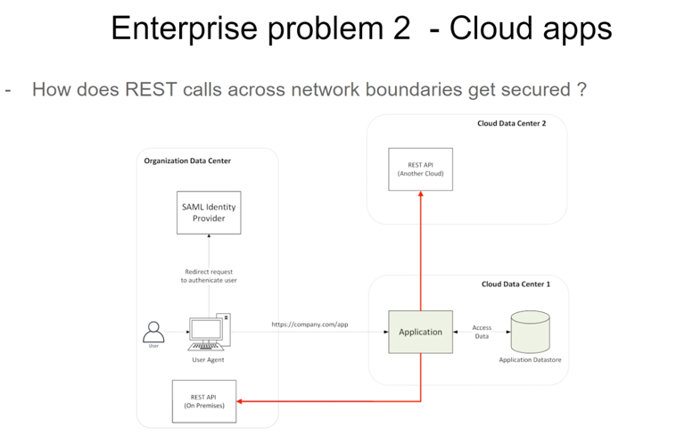
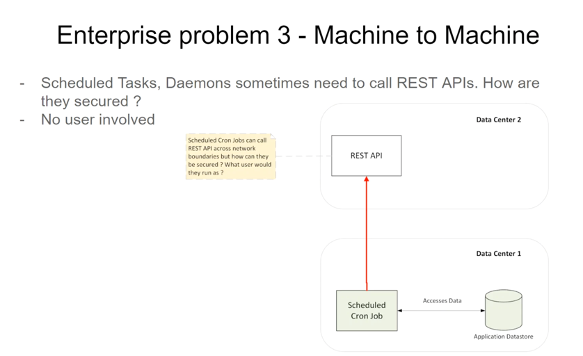
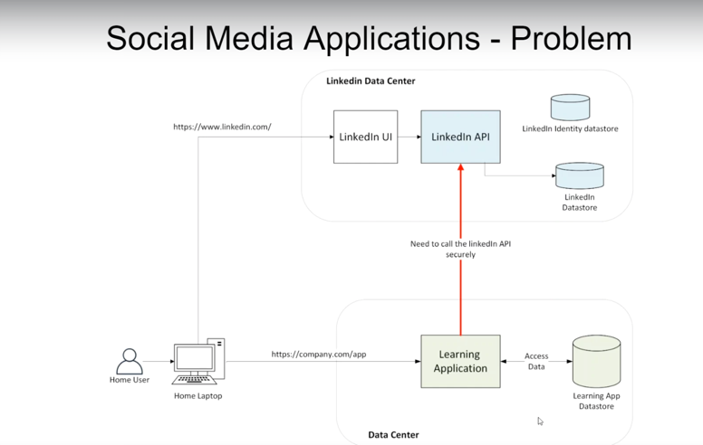
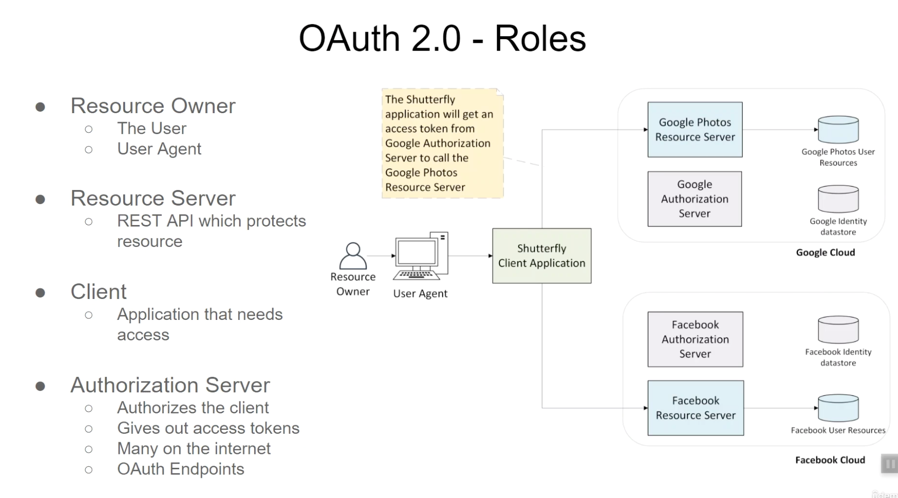
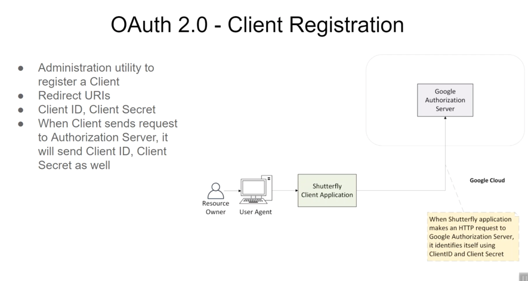
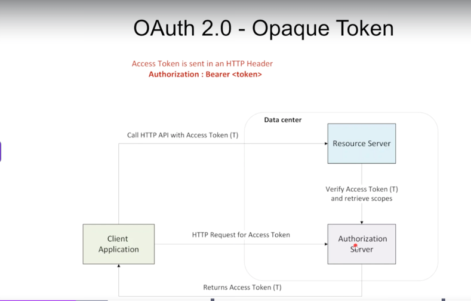
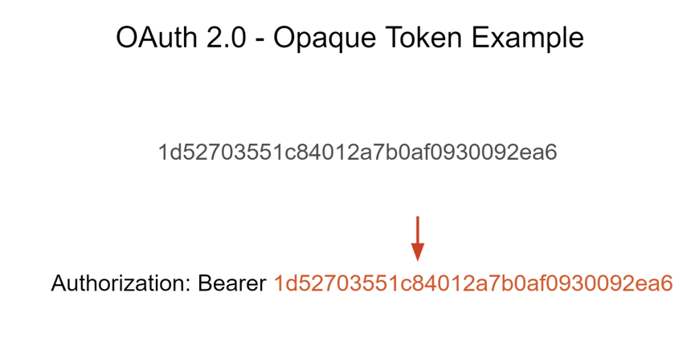
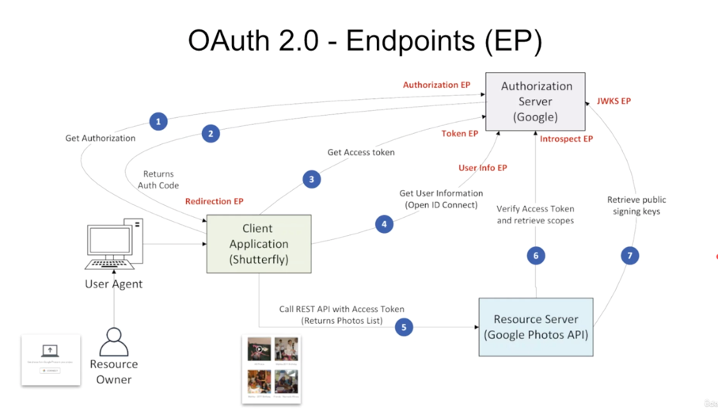

#   SAML Diagram

# why need oauth ?
        - Problem with saml.
            MS cant verify the saml received to them if they are outside of datacenter

        

    

# OAuth 2.0 Authorization Server
###  RFC6749

# Oauth 2.0 Opaque Token

# Endpoinds

