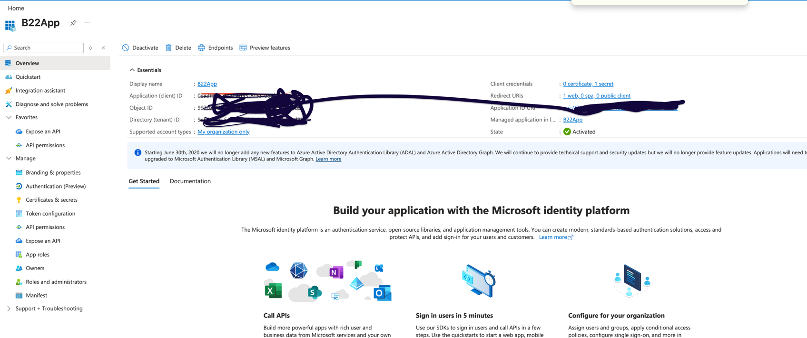
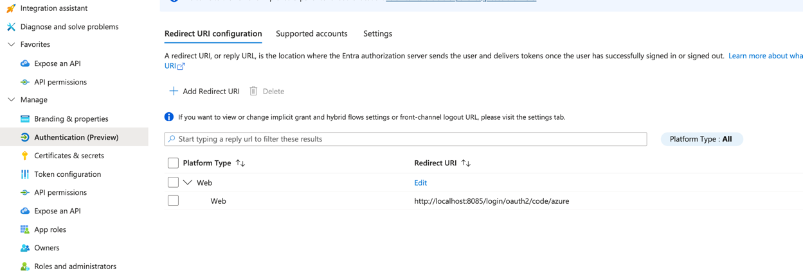
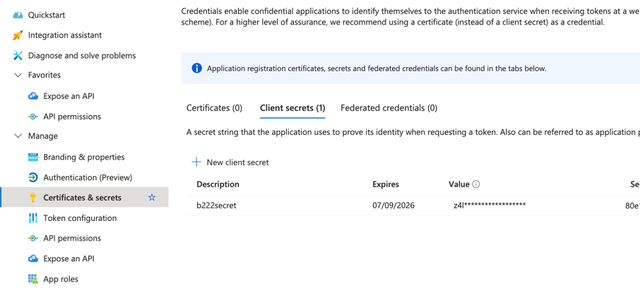
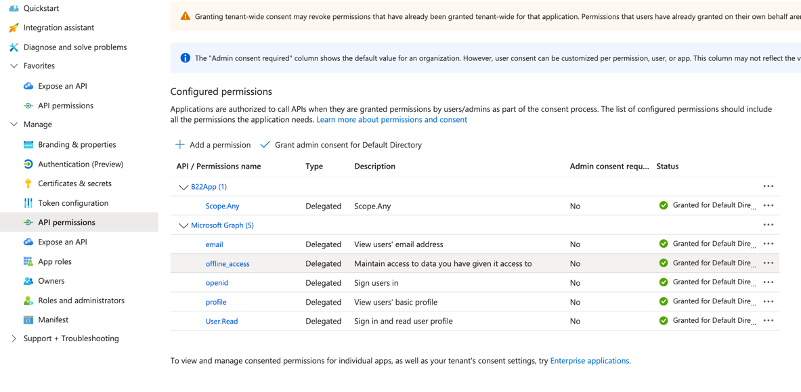
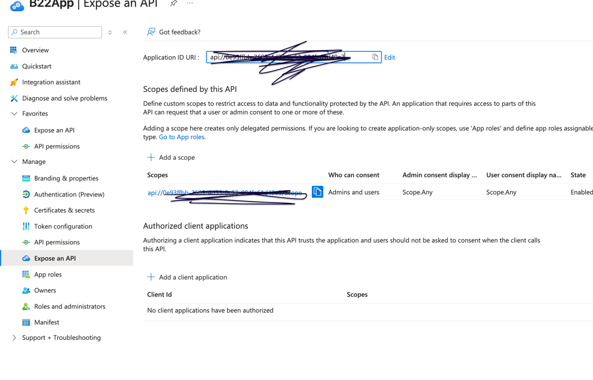

# This is B2c connect demo 

    Here I have created new service with just thymleaf with 1 html page to display
    And then added spring security and added some basic endpoint to redirect request with defualt passwword

# B2c application

    I have created tenants and register app in azure portal
    Create sample user and add to app registration

This is optional . this used in verify role. when we have backend and  FE diffrent

permit authentication api with toke

      auth.requestMatchers("/","/time","/login", "/login/oauth2/code/**","/login/oauth2/code/azure").permitAll()

Authentication endpoint to get code

        .authenticationEntryPoint(
                        new LoginUrlAuthenticationEntryPoint("/oauth2/authorization/azure")
                )

Success to home

             .oauth2Login(oauth2 -> oauth2
                        .defaultSuccessUrl("/home", true)

Application yml

              security:
                oauth2:
                  client:
                    registration:
                      azure:
                        client-id: ${CLIENTID}
                        client-secret: ${CLIENTSECRET}
                        authorization-grant-type: authorization_code
                        scope:
                          - openid
                          - profile
                          - User.Read
                          - email
                          - offline_access
                        redirect-uri: "{baseUrl}/login/oauth2/code/{registrationId}"
                        provider: azure
                    provider:
                      azure:
                        issuer-uri: https://login.microsoftonline.com/${TENANT}/v2.0

If you have authority in scope in token like scp: ReadDb then @preAuthorize('hasAuthority('SCOPE_ReadDb'')') will work
but if you have roles [ "APP_WRITE] then it wont work with hasAuthority actually its not part of granted authorityes its user attribute 
you need extract it and validate it

        Secret api {sub=O60XH_7JgOHRRxTVtXbPjt_0ATh9xBUC7saoPmRoRDc, ver=2.0, 
        aio=AYQAe/8bAAAAlI55hLHxQ+HbnpaOOVq7ccJTSF5ZZ+MzCegHJBFHisnfSCzWh9XOjmWeLQQhzBtdx1nbsBymtRBqXkccYeuLKjFPmPhosplWP1/jaysN8uLUsAsFYlCUV4eHZkk1Mkm3hEsKSPls+6PHB9mxHQ215Jre1yZ2vYlJz838teJHBpg=, 
        roles=[APP_READ],

ISS -> claim value is issuer 

        iss=https://login.microsoftonline.com/9e50631b-5455-43a3-bab0-48be8b6cbd98/v2.0
        in my case above is issuer and spring will add more to above issuer uri and call to 
        idp provider to validate sig
        