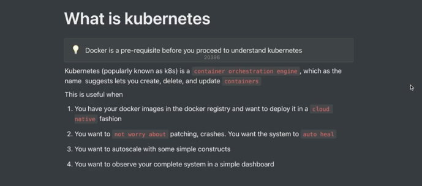
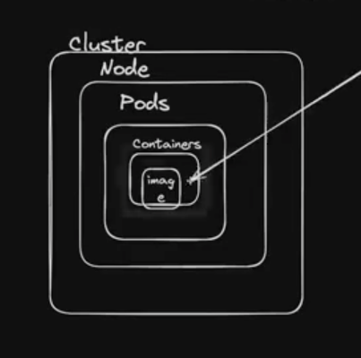
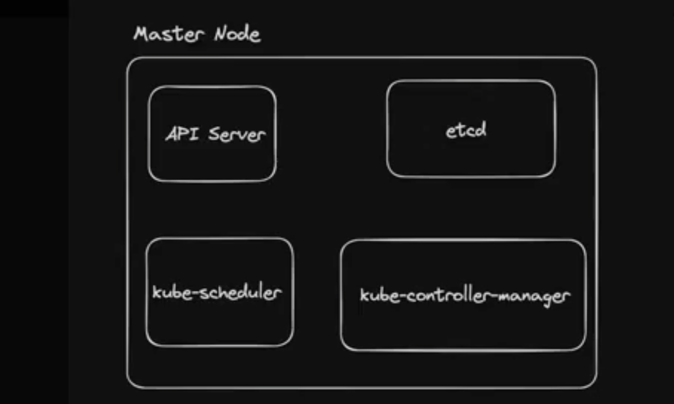
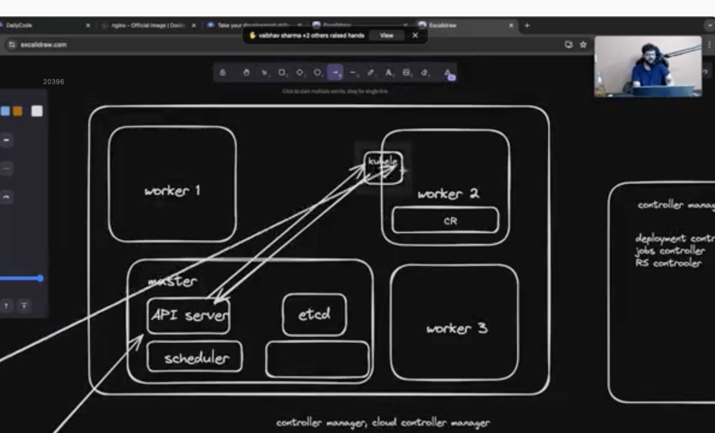
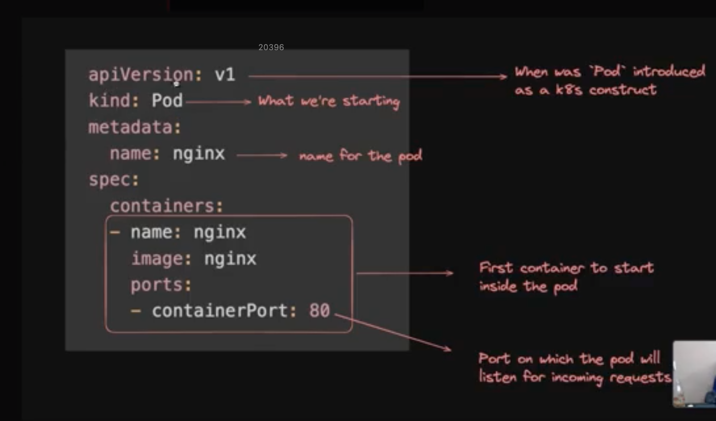
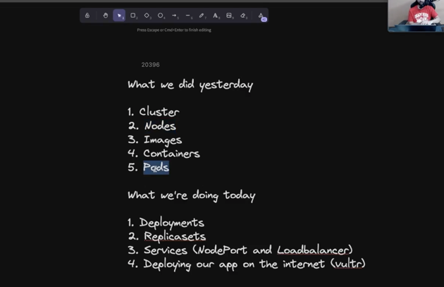
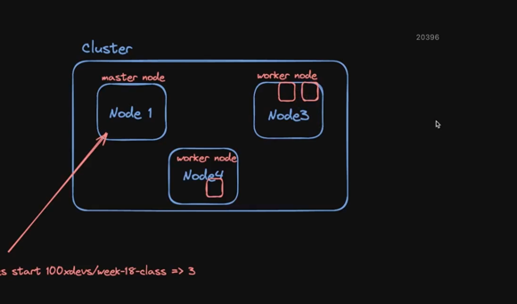

# Kubernates

# Pod -> single machine

# cluster - > one or multiple machine together

# container -> single runnable image

# cluster -> machine[node] -> pod -> container

# 2 main node 
## Master Node

# Etcd -> key - value db in kubernates but its distributed storage
        all activity storeged here for other components

# api-server -> all instruction go to api-server

# controller manager-> infinity checking 
        it keep checking deployment controll .. and other manager controller has to do anything
# container runtime -> its on worker node
        on each worker node kube-late running and checking is there pod need to deploy
        kube-late checking with api-server

# scheduler -> anything need to deploy scheduler update in etcd

# kube-proxy -> it runs on each node, 
        its networking component its job is to make sure traffic reaches the correct pod when you access a service
        - pods are dynamic -> ip keep chaanging
        - this will keep tracking of ips
        - it keep watching api server
        - maintaning n/w rules on each node
        - routing traffic from service -> correct pod
# start minikube -> minikube start
# to stat cluster
        kind create cluster --config cluster.yml --name local2

# k8s kubectl use cat ~/.kube/config to connect api-server

        kubectl run nginx --image=nginx --port=80
        kubectl describe pod nginx
        to run pod using yml
            kubectl apply -f manifest.yml
        

# deployment 
        - it mange pod, ensure disired num of pod are always running
        - support rolling update and rollback 
        - its high level abstraction that manage a set of pods and provide declarative update to them like scalling and rolling update

pods -> logical wrapper on container
inside the pod can have multiple container

