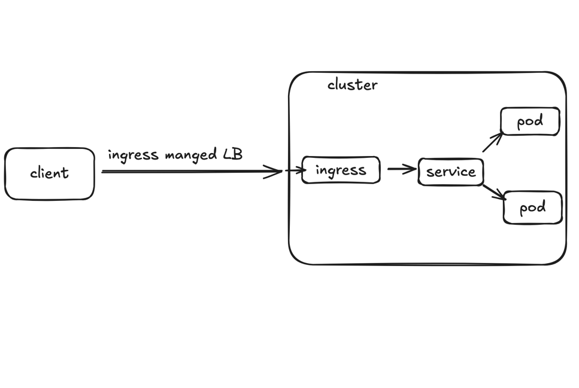
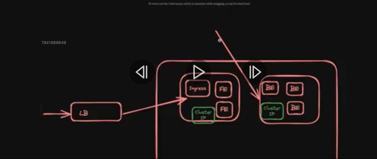
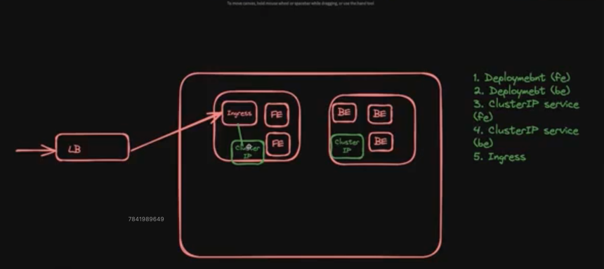
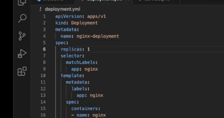
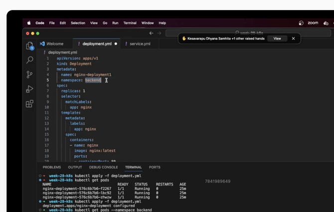

#Know
# cluster -> many machine
# pods-> one or many container
# node -> one or pod
# cluster -> one or many node
#replica -> multiple pod of same type [duplicate]
#deplyment -> replicaSet -> multiple pod
#update on deplymnt -> deplyment will create new replicaset
#it will remove old pod and create new -roling update
#service ? -> to visit -> open pod port mapping
#expose the pod,
#cluster Ip -> for internal comm, if 3 pod need intranl connectitvity
#node to commun required cluster ip service to conn each other
# if pod die no nned to worry cluster ip ll manage all
# for real user -> sending from outside
#then it required -> NodePort service
#  node port expose cluster ip, so not that good
# using LB it creates outside cluster , end user never knows ip of server
# this ideal way to expose service LB service is good
# it has somedown side too so we go for ingress
#flow for LB service to reach container
# client request -> LB  -> Cluster -> Node -> Pod-> container
# to view the kube config -> ~/.kube/config -> it container server to connect and credentials
#LB -> this will be outside of cluster, after applying service type--> LB
# it should start the LB, now we can send request using LB ip
# using this approach we dont need to worry about node ips, which was required in NodePort time
# this is clean approach used in production also
# is outside so need to delete separately
# service has some downside so better is ingress
# multiple app BE/FE and many then LB not enough
# certificate renovation extra work
# lb dont have rate limiting logic
# then how ? -> ingress, extra concept
# need to install additionally, ingress controller
#nginx ingress controller, haproxy ingress contrller, trafit  there are popular controller
# so the flow is

# no need to have separate lb any more if we have ingress managed LB
# just single  LB , ingress LB will look at the url and redirect to service if its FE or BE

# ingress controller automatically create ingress managed LB
# no need to separately create it
# one of from above 3 provider controller need to install 

# namespaces:
# structure pods, logical separation. imp-> many teams 
# its a part of metadata 

#Unknow
#rolling update
#cluster ip service
#node port service
# ingress
# kube config -> ~/.kube/config